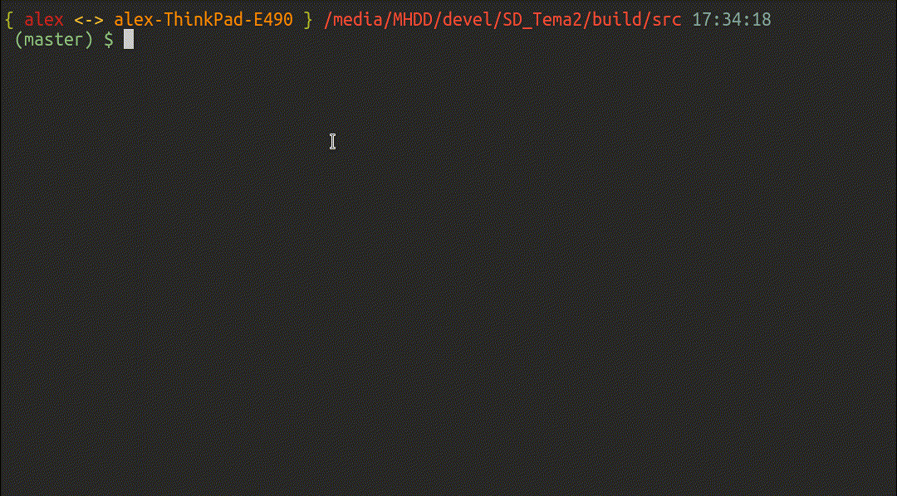

# Pairing Heap

In [src/pairing\_heap.hpp](https://github.com/AlexandruIca/SD_Tema2/blob/master/src/pairing_heap.hpp)
e implementata structura de date propriu-zisa cu
urmatoarele operatii:
* Insert
* Build
* Merge/Compare-and-link/Meld
* Delete-min
* Delete
* Modify
* O incercare de decrease-key

In [src/main.cpp](https://github.com/AlexandruIca/SD_Tema2/blob/master/src/main.cpp)
am mici teste pentru structura de date implementata + teste pentru bloom filter +
implementarea programului ce ia ca input [formatul](https://github.com/AlexandruIca/SD_Tema2/blob/master/src/test.txt)
dat ca tema.

In [src/bloom\_filter.hpp](https://github.com/AlexandruIca/SD_Tema2/blob/master/src/bloom_filter.hpp)
am implementat un bloom filter cu operatiile de insert si contains. In loc sa
folosesc double hashing am folosit un random number generator care ia ca seed
valoarea hashului pentru o cheie pe care vreau sa o inserez/verific si generez
numere random(index pentru biti) de atatea ori cate functii hash vreau. Asta
ar trebui sa faca bloom filter-ul mai predictibil. Pentru a-l face si un pic
mai rapid am implementat strategia si pe un bitset aliniat la marimea tipica a
unui cache line(64 bytes).

# Build

```sh
mkdir build && cd build
cmake ..
cmake --build .
```

# Demo

Pentru
```
14
1 5
1 3
1 7
1 9
1 2
3
4
3
1 0
3
1 8
1 8
1 8
2 8
```


